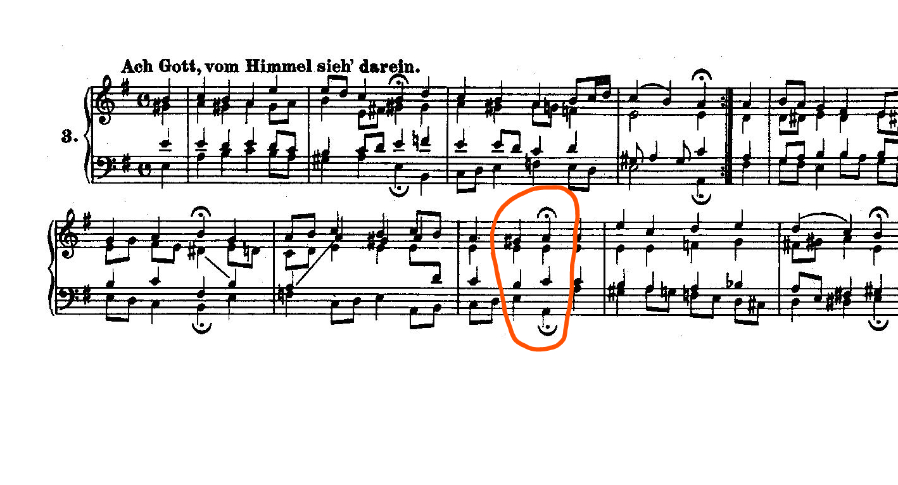
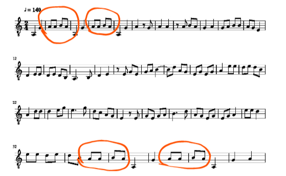

# C-Brahms

[C-Brahms](https://www.cs.helsinki.fi/group/cbrahms/) is a research group based at the [University of Helsinki](https://www.helsinki.fi/en). The group has been working on a few families of **S**ymbolic **M**elodic **S**imilarity (SMS) algorithms for over a decade. Currently, we aim to implement their geometric family of algorithms: P1-3, S1-2, W1-2. These approaches use a "piano roll" polyphonic representation. Each note is represented by a horizontal line segment in the Cartesian plane. The x-coordinate of a line segment can represent the onset (attack) or offset (release) of a note, while the y-coordinate represents a numeric pitch. There are two inputs to these algorithms: a query and a source. The output is a list containing the best matches of the query within the source. Each algorithm solves a different problem specification, so that "best match" can take on various definitions depending on the algorithm. 

All of these algorithms are transposition-invariant. A query may be matched to any of its twelve transpositions, without having to repeat an algorithm for all twelve of these possible queries.

## The Algorithms

The only implemented algorithms so far are P1 and P2. For runtime purposes, let m = len(query) and n = len(source)

### P1: Exact Matching 
Problem P1 finds all translations of the query such that all of its notes match exactly with some notes in the source. This means that the query may find a match in the source, even if the source contains extra intermittent notes or embellishments. Its default behaviour compares note onsets and ignores note duration: it will return a translation such that for each (onset, pitch) pair in the translated query, there is an identical pair in the source.
Optionally, the user can request that note durations must also be taken into account. A third option does not allow the source to have any intermittent notes or embellishments; in more technical terms, this third option will find a bijective map from the query onto a slice of the source.

The runtime of this algorithm is worst-case O(mn), but on average (in fact, in most use cases) will run in O(n).

### P2: Approximate Matching 
Problem P2 will find all translations of the query such that some of its notes match exactly with some notes in the source. As in P1, its default behaviour compares note onsets only, but an optional setting can make it take note duration into account. Additionally, by default it will return translations which minimize the number of mismatches, so that if there exist exact matches in the source, P2 will behave identically to P1. Alternatively you can pass an integer to the -o flag when running P2 to display translations which have a specific number of mismatches.

The runtime of P2 is O(mnlogm)

## Running Scripts

Query and source files are passed in by file name, using relative file names from the c-brahms directory. There are a few use cases:

1) with one source file

    ```$ python find_matches.py algorithm option query source```

2) with a directory of source files

    ```$ python find_matches.py algorithm query -d directory```

3) with optional algorithm settings

    ```$ python find_matches.py algorithm -o [option] query source```
    ```$ python find_matches.py algorithm -o [option] query -d directory```

Currently, the supported options for each algorithm are:

#### P1 Options
```onset``` (DEFAULT) : only line segment onsets are used to calculate exact matches
```segment``` (not implemented) : line segment onsets AND offsets are used to calculate exact matches

#### P2 Options
```min``` (DEFAULT): approximate matches which minimize the number of mismatches are displayed
```onset``` (DEFAULT): only line segment onsets are used to calculate exact matches
```segment``` (not implemented): line segment onsets AND offsets are used to calculate exact matches
```all```: all possible approximate matches are displayed (a total of len(source) * len(query) matches)
```int x```: all approximate matches with exactly x mismatches are displayed. Ex. P2 -o 0 will behave exactly the same as P1 except with a longer runtime.

#### P3 Options
P3 is not currently functional.

## Tests

There are two major types of test cases: those which use the midiparser, and those which don't. The former require scores, and implicitly test the parser as well as the algorithms in a real-world use case. The expected values for these test cases are obtained by exhasutively counting the measure number and beat of all expected matches within a piece. Test cases which don't use the midi parser instead have lists of hard-coded data to check for precise edgecases.

### Exact Matches Suite
The specification for "match" becomes more and more generalized as we progress through the family of algorithms P1, P2, P3, S1, S2, W1, and W2. The result is that, given zero error tolerance, all eight algorithms should be able to behave exactly like P1. Thus, the "EXACT_MATCHES_SUITE" is designed to check for P1 functionality as well as zero-error tolerance for the other seven algorithms. The test cases in this suite are parameterized with nose-parameterize so that they are easily run with all eight algorithms.

Queries and sources used for ground truth:

#### Bach BWV2 Chorale
The query is a V-i cadence found at onset 30. The result for each algorithm should be \[[30.0, 0]\] (a horizontal translation of 30, and a vertical translation of 0)



#### Chidori Meimei Folk Song
The query is a four note eighth note pattern first seen in measure 2. It occurs at onsets 2, 6, 65, and 69, with the same pitches. The query is given a whole tone below the source to test for proper transposition-invariance.



### Lemstrom Example Suite
In Lemstrom and Laitinen's 2011 paper, the authors included a musical example in which all 8 algorithms P1-3, S1-2, and W1-2 could find specific queries. This example was transcribed and imbedded in a test suite.

### Specific Algorithm Suites
Each algorithm has unique settings and edgecases which must be tested separately; these are found in files named 'test_$algorithm.py'

## References

E. Ukkonen, K. Lemström, and V. Mäkinen, “Geometric algorithms for transposition invariant content-based music retrieval,” in Proceedings of the Fourth International Conference on Music Information Retrieval. Baltimore, Maryland, USA: The John Hopkins University, 2003, p. 193–199.

M. Laitinen and K. Lemström, “Dynamic Programming in Transposition and Time-Warp Invariant Polyphonic Content-Base Music Retrieval,” in 20 Proceedings of the 12th International Society for Music Information Retrieval Conference, A. Klapuri and C. Leider, Eds., no. Ismir. Miami, Florida, USA: University of Miami, 2011, pp. 369–374.
